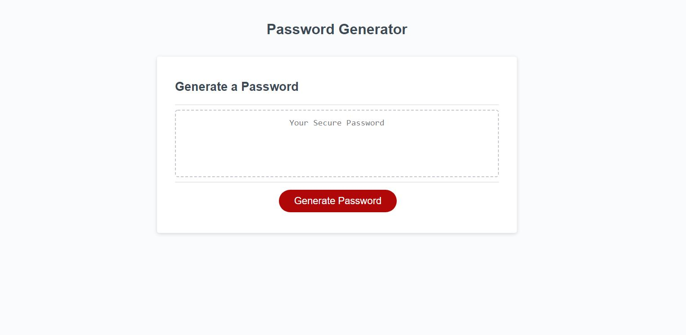
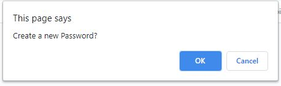
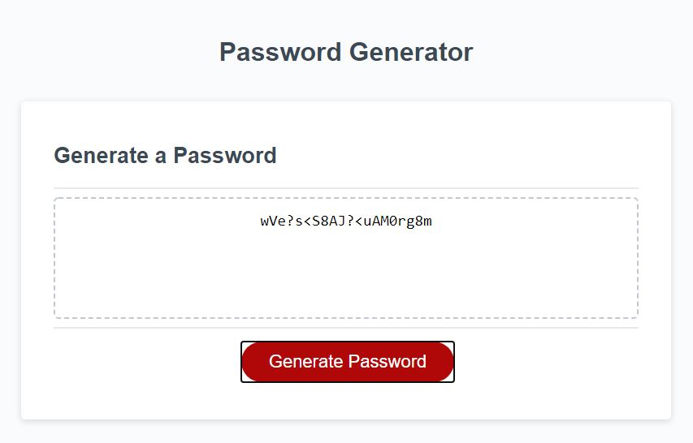

# password-generator
## Description 

The purpose of this project is to provide a password generator that can be used by anyone. The generator must take into account the length of the password as well as which types of characters to use in the password generation. When the "Generate Password" button is clicked the user will follow a series of prompts. The randomely generated password will then be displayed in the box.

The webpage is hosted on [GitHub](https://rconat.github.io/password-generator/).

You can find the repo on [GitHub](https://github.com/Rconat/password-generator).

## Table of Contents

* [List of Files](#List-of-Files)
* [Usage](#usage)
* [Credits](#credits)

## List of Files

<ul>
    <li>index.html</li>
    <li>style.css</li>
    <li>script.js</li>
    <li>README.md</li>
    <li>main.jpg</li>
    <li>password.jpg</li>
    <li>prompt1.jpg</li>
    <li>prompt2.png</li>
    <li>prompt3.jpg</li>
</ul>

## Usage 

Using prompts upon clicking the "Generate Password" button the user will select the length (between 8 and 128) and if the user would like to use numbers, uppercase letters, lowercase letters, special characters, or any combination of those four options. The generator spits out a random password and you are free to click the button to generate another. The generator clears the displayed value so that there is no need to refresh the page in order to run the password generator again.

---

